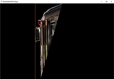
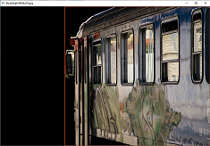

# OpenImage2COCO converter

An easy-to-use tool for converting OpenImage csv annotations into COCO-format json annotations. The tools can both convert bbox annotation file and segmentation annotation file.

## Requirements

- Python3
- OpenCV
- Pandas
- pycocotools
- scikit-image

## Usage

- Import openimage2coco module

1. Init a converter(Required)

   ```python
   converter = OpenImage2COCO(image_root=args.im_root,
                              segm_image_root=args.seg_im_root,
                              openimage_bbox_file=args.op_bbox_anno,
                              openimage_seg_file=args.op_segm_anno,
                              openimage_cls_info_file=args.op_cls_info,
                              which_set=args.which_set,
                              convert_cls_into_coco=not args.not_conv_cls
               )
   ```

2. Convert bbox csv file into coco-format(Optional)

   ```python
   converter.convert_bbox(save_path='openimage_coco_format_{}_bbox.json'.format(args.which_set))
   ```

3. Convert segmentation csv file into coco-format(Optional)

   ```
   converter.convert_segmentation(save_path='openimage_coco_format_{}_segm.json'.format(args.which_set))
   ```

4. Visualize converted bbox file(Optional)

   ```python
   converter.visualize_bbox(save_path='openimage_coco_format_{}_bbox.json'.format(args.which_set))
   ```

5. Visualize converted segmentation file(Optional)

   ```python
   converter.visualize_segmentation(save_path='openimage_coco_format_{}_segm.json'.format(args.which_set))
   ```

- Run in terminal

  ```bash
  python openimage2coco.py --im_root ../image --op_bbox_anno ../annotations/validation-annotations-bbox.csv --op_cls_info ../annotations/class-descriptions-boxable.csv --which_set val --op_segm_anno ../annotations/validation-annotations-object-segmentation.csv --seg_im_root ../mask_image
  ```

  

## Tips

- The arguments you need to pass:

  - --im_root: the image root of OpenImage dataset, should contain at least one of these folders: train, test, val;
  - --seg_im_root: if you need to convert segmentation file, you need to specify this argument which is the  image root of OpenImage dataset, should contain at least one of these folders: train, test, val;
  - --op_bbox_anno: the OpenImage bbox annotation file path;
  - --op_segm_anno: the OpenImage segmentation annotation file path;
  - --op_cls_info: the OpenImage class info csv file(600 classes for detection, 350 classes for segmentation);
  - --which_set: one of ['train', 'test', 'val'];
  - not_conv_cls: whether to convert OpenImage classes into coco 80 classes. The class mapping relations are defined from L34-L54. L34-L43 uses COCO classes name and OpenImage classes name as key and value, while L45-L54 uses COCO classes name and OpenImage classes id as key and value. Just feel free to modify!

- L352-L355

  - Make sure the outermost pixels in the mask before converting is all zero, otherwise the edge-detection algorithm will fail to work.

    |     |   |                                       |                    |
    | ------------------ | ----------------- | ------------------------------------------------------------ | -------------------------------------- |
    | Image in OpenImage | The mask of image | Without setting the outermost pixels to 0 | With setting the outermost pixels to 0 |
